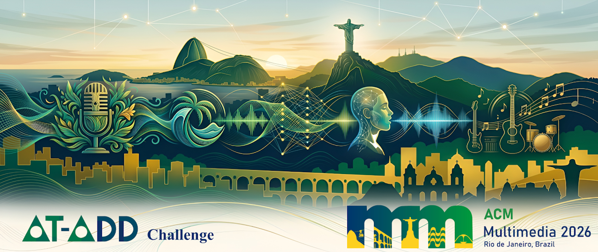

<h1 align="center">AT-ADD Challenge Baseline</h1>

<p align="center">
  <a href="https://www.at-add.com">
    
  </a>
  &nbsp;
  <a href="">
    
  </a>
</p>

<p align="center">
  
</p>

This repository provides the official baseline implementation for the **AT-ADD: All-Type Audio Deepfake Detection Challenge**.

---

## 1. Data Preparation

### Dataset Structure

Please download the AT-ADD dataset and organize it as follows:

```
atadd/
├── T1/
│   ├── train/
│   │   └── *.wav
│   ├── dev/
│   │   └── *.wav
│   ├── eval/
│   │   └── *.wav
│   └── label/
│       ├── train.csv
│       ├── dev.csv
├── T2/
│   ├── train/
│   │   └── *.wav
│   ├── dev/
│   │   └── *.wav
│   ├── eval/
│   │   └── *.wav
│   └── label/
│       ├── train.csv
│       ├── dev.csv
```

---

### Configuration

Modify the dataset paths in `config.py` or pass them via command-line arguments:

```
--atadd_t1_train_audio
--atadd_t1_train_label
--atadd_t1_dev_audio
--atadd_t1_dev_label
--atadd_t1_eval_audio

--atadd_t2_train_audio
--atadd_t2_train_label
--atadd_t2_dev_audio
--atadd_t2_dev_label
--atadd_t2_eval_audio
```

---

## 2. Environment Setup

```bash
conda create -n atadd python=3.10.13
conda activate atadd
pip install -r requirements.txt
```

---

## 3. SSL Model Preparation

Download the pre-trained SSL model from Hugging Face:

```bash
huggingface-cli download facebook/wav2vec2-xls-r-300m \
  --local-dir yourpath/huggingface/wav2vec2-xls-r-300m/
```

Then update the path in `config.py`:

```
--xlsr yourpath/huggingface/wav2vec2-xls-r-300m
```

---

## 4. Training

### Baseline Models

⚠️ The hyperparameters in the provided scripts (e.g., learning rate, batch size, random seed) follow the settings reported in the original papers. Modifying them—especially for fine-tuning—may lead to noticeable performance differences.

```bash
cd AT-ADD-Baseline
bash train.sh
```

---

## 5. Evaluation

```bash
bash test.sh
```

This will generate `logits.csv` in the corresponding checkpoint directory.

### Generate Predictions

```bash
python generate_predict.py
```

The script applies a default threshold of **0.5** to produce `predict.csv`, which can be directly used for submission.

---

## 6. Additional Baselines

This implementation is adapted from:

https://github.com/xieyuankun/All-Type-ADD

Several additional models are also supported (see `config.py`):

```python
choices = [
    'specresnet', 'aasist',
    'fr-w2v2aasist', 'fr-wavlmaasist', 'fr-mertaasist',
    'ft-w2v2aasist', 'ft-wavlmaasist', 'ft-mertaasist',
    'pt-w2v2aasist', 'wpt-w2v2aasist',
    'pt-wavlmaasist', 'wpt-wavlmaasist',
    'pt-mertaasist', 'wpt-mertaasist'
]
```

Feel free to explore and extend these models.

Additionally, this framework supports **data augmentation** methods such as MUSAN, RIR, and RawBoost. These augmentations can be enabled in the dataset initialization, and are disabled by default.

## Acknowledgment

We gratefully acknowledge the following works, which serve as important baselines and foundations for this repository:

**AASIST**
```bibtex
@inproceedings{jung2022aasist,
  title={Aasist: Audio anti-spoofing using integrated spectro-temporal graph attention networks},
  author={Jung, Jee-weon and Heo, Hee-Soo and Tak, Hemlata and Shim, Hye-jin and Chung, Joon Son and Lee, Bong-Jin and Yu, Ha-Jin and Evans, Nicholas},
  booktitle={Proceedings of the ICASSP},
  pages={6367--6371},
  year={2022}
}
```

**FT-XLSR-AASIST**
```bibtex
@inproceedings{tak2022automatic,
  title={Automatic Speaker Verification Spoofing and Deepfake Detection Using Wav2vec 2.0 and Data Augmentation},
  author={Tak, Hemlata and Todisco, Massimiliano and Wang, Xin and Jung, Jee-weon and Yamagishi, Junichi and Evans, Nicholas},
  booktitle={The Speaker and Language Recognition Workshop (Odyssey 2022)},
  year={2022},
  organization={ISCA}
}
```

**WPT-XLSR-AASIST**
```bibtex
@inproceedings{xie2026detect,
  title={Detect all-type deepfake audio: Wavelet prompt tuning for enhanced auditory perception},
  author={Xie, Yuankun and Fu, Ruibo and Wang, Xiaopeng and Wang, Zhiyong and Cao, Songjun and Ma, Long and Cheng, Haonan and Ye, Long},
  booktitle={Proceedings of the AAAI Conference on Artificial Intelligence},
  volume={40},
  number={42},
  pages={35922--35930},
  year={2026}
}
```
